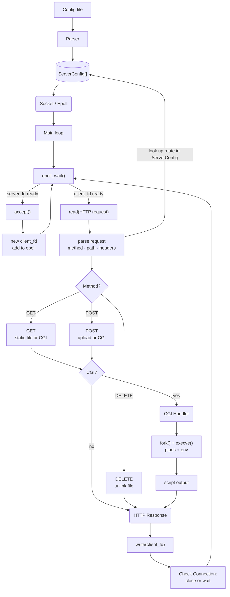
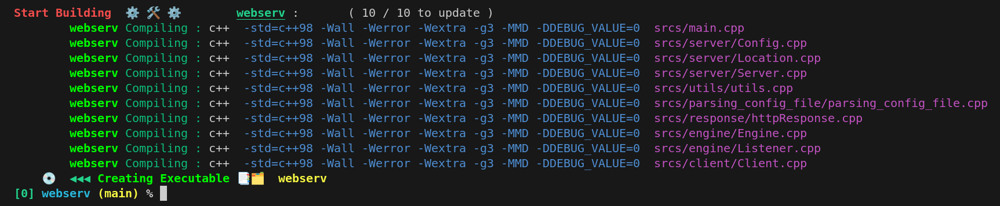
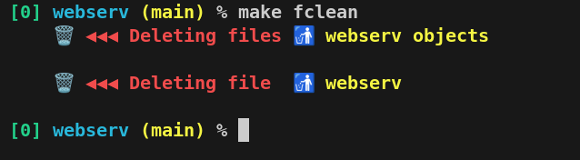
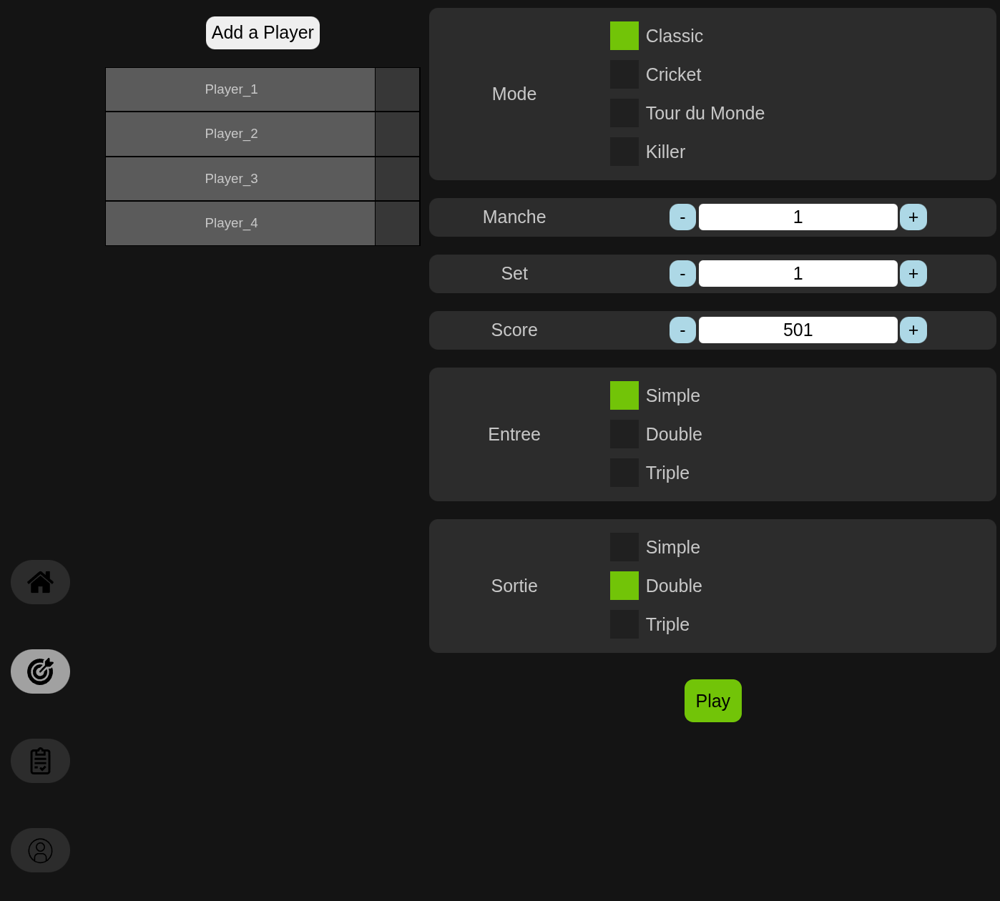
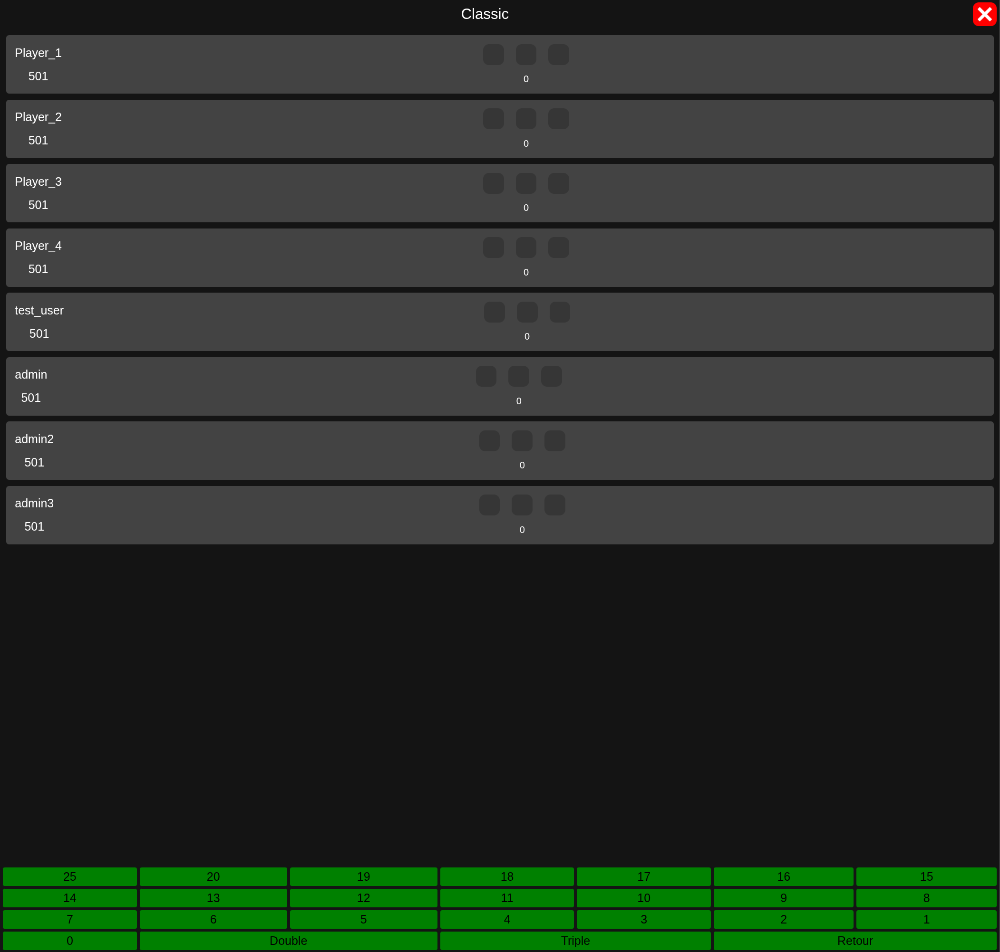
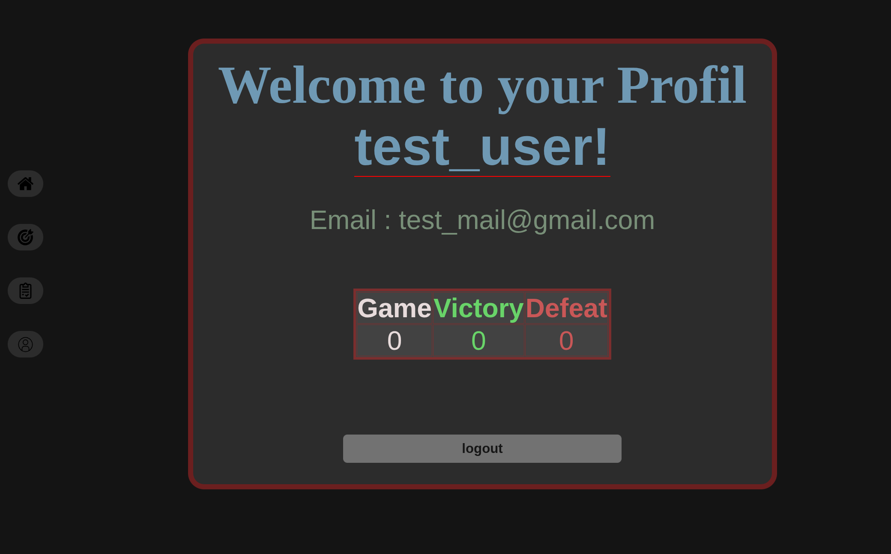

> *This project has been created as part of the 42 curriculum by samaouch, tjooris, ale-guel.*
<!-- Custom fonts -->
<!-- 𝔸 𝔹 ℂ 𝔻 𝔼 𝔽 𝔾 ℍ 𝕀 𝕁 𝕂 𝕃 𝕄 ℕ 𝕆 ℙ ℚ ℝ 𝕊 𝕋 𝕌 𝕍 𝕎 𝕏 𝕐 ℤ -->

<div align="center">
  <b><font size="7">🌐 𝕎𝕖𝕓𝕤𝕖𝕣𝕧</font></b>
  <p><i>A C++98 Non-blocking HTTP/1.1 Server</i></p>
</div>

---


<details open>
    <summary>
        <h4>📑 𝕊ummary</h4> 
    </summary>
<blockquote>

- 📍 [𝔻escription](#description)
    - 📍[Core Features](#core)
    - 📍 [Technical Constraints](#constraints)
    - 📍 [Team Workflow](#team)
    - 📍 [System Architecture](#graph)
- 📍 [𝕀nstructions](#instructions)
    - 📍 [Compilation](#compilation)
    - 📍 [Execution](#usage)
    - 📍 [Configuration files](#config)
- 📍 [ℝesources](#resources)
- 📍 [𝔹onus: Interactive Web Demo](#demo)
</blockquote>
</details>

<b><font size="2">*end*[^1]</b></font>

--- 

<details id="description">
    <summary>
        <h2>𝔻escription</h2>
    </summary>

<blockquote>

This project involves developing an **HTTP/1.1, HTTP/1.0 Web Server** from scratch. The primary goal is to gain a deep understanding of the HTTP protocol, socket programming, and the underlying mechanics of the internet.

<dl><dd>
<details id="core">
    <summary>
        <h3>🚀 Core Features</h3>
    </summary>

<blockquote>

- **Multi-Port Listening:** Simultaneously manage multiple virtual servers on different ports.
- **HTTP Methods:** Full support for `GET`, `POST`, and `DELETE`.
- **Static Content:** Serve complete static websites with custom error page management.
- **File Upload:** Enable clients to upload files directly to the server.
- **CGI Engine:** Execute dynamic scripts (Python, PHP, etc.) via specific file extensions.
- **Directory Listing:** Automatically generate index pages for directories when enabled.

</blockquote>
</details>
</dd></dl>


<dl><dd>
<details id="constraints">
    <summary>
        <h3>⚙️ Technical Constraints</h3>
    </summary>

<blockquote>

| Category | Specification |
|:-------|:------:| 
| **Standard** | C++ 98 |
| **I/O Model** | Non-blocking using `epoll` (Single instance) |
| **Protocol** | HTTP/1.1, HTTP/1.0 (Chunked encoding supported) |
| **Stability** | Zero crashes, zero leaks, no indefinite hangs |
| **Processes** | `fork()` used exclusively for CGI execution |

</blockquote>
</details>
</dd></dl>


<dl><dd>
<details id="team">
    <summary>
        <h3>🤝 Team Workflow</h3>
    </summary>

<blockquote>

We chose **epoll** for efficient socket event management. 
Our workflow started with individual research, followed by a collaborative phase where we identified four main modules: **Configuration Parsing**, **Socket/Epoll Management**, **Request Parsing**, and **Response Generation**.

- **Tools:** Git, Mermaid.live, Discord.
- **Communication:** Weekly in-person meetings, continuous sync via Discord.
- **Standards:** Clean commit history and mandatory Peer-Review (PR) before merging.

</blockquote>
</details>
</dd></dl>

<dl><dd>
<details id="graph">
    <summary>
        <h3>⛓️ System Architecture</h3>
    </summary>

<blockquote>



</blockquote>
</details>
</dd></dl>

</blockquote>
</details>

---

<details id="instructions">
    <summary>
        <h2>𝕀nstructions</h2>
    </summary>

<blockquote>

<dd><dl>
<details id="compilation">
    <summary>
        <h3>🏗️ Compilation</h3>
    </summary>

<blockquote>

`make`: Compiles the `webserv` executable.  
`make clean`: Removes object file (`.o`).  
`make fclean`: Removes object files and the `webserv` executable.  
`make re`: Recompiles the entire project from scratch.  
<br>

* <ins>**Build the project:**</ins>

    ```bash
    make
    ```
    


* <ins>**Cleanup:**</ins>

    ```bash
    make fclean
    ```
    


</blockquote>
</details>
</dd></dl>

<dd><dl>
<details id="config">
    <summary>
        <h3>📂 Configuration files</h3>
    </summary>

<blockquote>

The server uses a custom configuration format inspired by **Nginx** (logic) and **YAML** (clean, indentation-based syntax).  
<br>
*Note: Each indentation level must be consistent (1 tab).*
* <ins>**Key Rules:**</ins>
    * **Indentation matters**: Blocks like `locations` are defined by their indentation level.
    * **Directives**: Simple `key value` pairs.
    * **Multiple entries**: Easily define multiple `error_pages` or `methods`.

**Configuration Example (`www/config`):**

```yml
server
	listen 8080
	root ./www/
	server_name site.com
	methods GET POST

    # Custom error page
	error_pages 401 ./file/error_page/error_page_401.html
	error_pages 403 ./file/error_page/error_page_403.html
	error_pages 404 ./file/error_page/error_page_404.html
	error_pages 405 ./file/error_page/error_page_405.html
	error_pages 409 ./file/error_page/error_page_409.html
	error_pages 411 ./file/error_page/error_page_411.html
	error_pages 413 ./file/error_page/error_page_413.html
	error_pages 500 ./file/error_page/error_page_500.html
	error_pages 501 ./file/error_page/error_page_501.html

    # Redirection example
	locations /
		methods GET
		return 301 /Home

    # Static Routes
	locations /Home
		alias ./www/html/Home.html
	locations /Dart
		alias ./www/html/Dart.html
	locations /Account
		methods GET
		alias ./www/html/Account.html
	locations /signup
		methods GET POST
		alias ./www/html/Connected.html
	locations /signin
		methods GET POST
		alias ./www/html/Connected.html
	locations /logout
		methods GET
		alias ./www/html/Account.html
    
    # Static Asset
	locations /img/
		alias ./www/static/

    # CGI Configuration
	locations /css/
	locations /js/
	locations /cgi/
		alias ./
		cgi_enabled true
		methods GET POST
		cgi_ext .py /usr/bin/python3

	locations /Test
		alias ./www/html/test.html
```

</blockquote>
</details>
</dd></dl>

<dd><dl>
<details id="usage">
    <summary>
        <h3>⚡ Execution</h3>
    </summary>

<blockquote>

To launch the server, provide a configuration file as an argument:

```bash
./webserv [configuration_file]
``` 
</blockquote>
</details>
</dd></dl>

</blockquote>
</details>


---

<details id="ressources">
    <summary>
        <h2>ℝessources</h2>
    </summary>

📚 Global References
> [Beej's Guide to Network Programming:](https://beej.us/guide/bgnet/): The absolute Bible for socket programming in C++.  
> [RFC 9112 - HTTP/1.1](https://www.rfc-editor.org/rfc/rfc9112.html): The official technical specifications for the HTTP/1.1 protocol.  
> [MDN Web Docs - HTTP Status Codes](https://developer.mozilla.org/en-US/docs/Web/HTTP/Reference/Status): Clear and detailed explanations of every HTTP status code.  
> [The Method to Epoll's Madness](https://copyconstruct.medium.com/the-method-to-epolls-madness-d9d2d6378642): A deep dive into how epoll works and why it's efficient.  
> [HTTP Network & Security Course](https://www.pierre-giraud.com/http-reseau-securite-cours/): A comprehensive French guide to understanding web networks.  

<br>

🛠️ Tools & Testing  
>[Httpbin.org](https://httpbin.org/): A simple HTTP Request & Response Service (useful for testing headers).  
>[ByteByteGo](https://bytebytego.com/guides/important-things-about-http-headers-you-may-not-know/) - HTTP Headers: Visual guides for understanding complex headers and cookies.

<br>

🤖 AI Usage  
>In accordance with modern development practices, AI was used as a supportive tool for:  
>**Translation**: From French to English.  
>**Concept Clarification**: Helping to summarize complex RFC points into simplified logic.

</details>

---

<details id="demo">
    <summary>
        <h2>🌟 Bonus: Interactive Web Demo 🌟</h2>
    </summary>

> As a proof of concept, we developed a frontend to test the server's limits. Although the game logic is still a work in progress, it perfectly demonstrates our CGI implementation and Request handling.

<br>

🔐 User Authentication  
> Testing POST methods and session logic through Login and Sign-up pages.  


🎯 Dart Game Engine & Scoring  
> A dynamic interface where you can add players.  
> *Note: The dartboard is currently accessible at /Test as we refine the game logic.*  
<br>
>
>   
>
> <br>
>
>   
>
> <br>
>
>   

<br>

🏆 Scoreboard and Profil  
>
> 

CGI location
> The data is processed via CGI to calculate time location with Python script.

</details>

[^1]:*begin*
