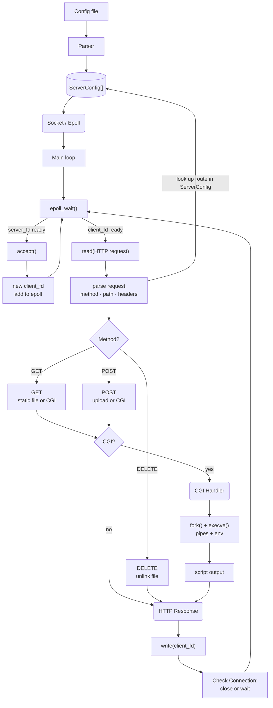

> *This project has been created as part of the 42 curriculum by samaouch, tjooris, ale-guel.*
<!-- Custom fonts -->
<!-- 𝔸 𝔹 ℂ 𝔻 𝔼 𝔽 𝔾 ℍ 𝕀 𝕁 𝕂 𝕃 𝕄 ℕ 𝕆 ℙ ℚ ℝ 𝕊 𝕋 𝕌 𝕍 𝕎 𝕏 𝕐 ℤ -->

  <b>𝕎𝕖𝕓𝕤𝕖𝕣𝕧</b>
  
<i>A C++98 Non-blocking HTTP/1.1 Server</i>

---

    

        <h4>𝕊ummary</h4> 
    

<blockquote>

- [𝔻escription](#description)
    - [Core Features](#core)
    - [Technical Constraints](#constraints)
    - [Team Workflow](#team)
    - [System Architecture](#graph)
- [𝕀nstructions](#instructions)
    - [Compilation](#compilation)
    - [Execution](#usage)
    - [Configuration files](#config)
- [ℝesources](#resources)
- [𝔸dditional sections](#add)
</blockquote>

<b>*end*[^1]</b>

--- 

    

        <h2>𝔻escription</h2>
    

<blockquote>

This project involves developing an **HTTP/1.1, HTTP/1.0 Web Server** from scratch. The primary goal is to gain a deep understanding of the HTTP protocol, socket programming, and the underlying mechanics of the internet.

<dl><dd>

    

        <h3>Core Features</h3>
    

<blockquote>

- **Multi-Port Listening:** Simultaneously manage multiple virtual servers on different ports.
- **HTTP Methods:** Full support for `GET`, `POST`, and `DELETE`.
- **Static Content:** Serve complete static websites with custom error page management.
- **File Upload:** Enable clients to upload files directly to the server.
- **CGI Engine:** Execute dynamic scripts (Python, PHP, etc.) via specific file extensions.
- **Directory Listing:** Automatically generate index pages for directories when enabled.

</blockquote>

</dd></dl>

<dl><dd>

    

        <h3>Technical Constraints</h3>
    

<blockquote>

| Category | Specification |
|:-------|:------:| 
| **Standard** | C++ 98 |
| **I/O Model** | Non-blocking using `epoll` (Single instance) |
| **Protocol** | HTTP/1.1, HTTP/1.0 (Chunked encoding supported) |
| **Stability** | Zero crashes, zero leaks, no indefinite hangs |
| **Processes** | `fork()` used exclusively for CGI execution |

</blockquote>

</dd></dl>

<dl><dd>

    

        <h3>Team Workflow</h3>
    

<blockquote>

We chose **epoll** for efficient socket event management. 
Our workflow started with individual research, followed by a collaborative phase where we identified four main modules: **Configuration Parsing**, **Socket/Epoll Management**, **Request Parsing**, and **Response Generation**.

- **Tools:** Git, Mermaid.live, Discord.
- **Communication:** Weekly in-person meetings, continuous sync via Discord.
- **Standards:** Clean commit history and mandatory Peer-Review (PR) before merging.

</blockquote>

</dd></dl>

<dl><dd>

    

        <h3>👀 System Architecture</h3>
    

<blockquote>

</blockquote>

</dd></dl>

</blockquote>

---

    

        <h2>𝕀nstructions</h2>
    

<blockquote>

`` Section containing any relevant informaton about compilation, installation, and/or execution. ``

<dd><dl>

    

        <h4>Compilation</h4>
    

<blockquote>

</blockquote>

</dd></dl>

<dd><dl>

    

        <h4>Execution</h4>
    

<blockquote>

</blockquote>

</dd></dl>

<dd><dl>

    

        <h4>Configuration files</h4>
    

<blockquote>

</blockquote>

</dd></dl>

</blockquote>

---

    

        <h2>ℝessources</h2>
    

`` Section listing classic references related to the topic (documentation, articles, tutorials, etc.), as well as description of how AI was used specifying for which tasks and which parts of the project. ``

---

    

        <h2>𝔸dditional sections</h2>
    

`` (e.g, usage examples, feature list, technical choices, etc.). ``

[^1]:*begin*
