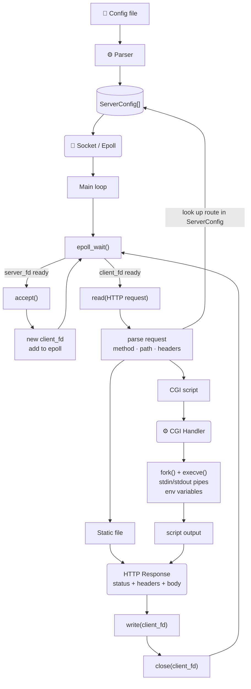

1
gerer le parsing d'un fichier .conf

2
gestion des CGI

3
Gerer les socket

---

```mermaid

flowchart TB
    A["📄 Config file"] --> B["⚙️ Parser"]
    B --> CFG[("ServerConfig[]")]
    CFG --> EPOLL["🔌 Socket / Epoll"]
    EPOLL --> LOOP["Main loop"]
    LOOP --> WAIT["epoll_wait()"]
    WAIT -- server_fd ready --> ACCEPT["accept()"]
    ACCEPT --> NEWCLIENT["new client_fd<br>add to epoll"]
    NEWCLIENT --> WAIT
    WAIT -- client_fd ready --> READ["read(HTTP request)"]
    READ --> PARSE["parse request<br>method · path · headers"]
    PARSE -- look up route in ServerConfig --> CFG
    PARSE --> STATIC["Static file"] & CGIROUTE["CGI script"]
    STATIC --> RESP["HTTP Response<br>status + headers + body"]
    CGIROUTE --> CGIHANDLER["⚙️ CGI Handler"]
    CGIHANDLER --> FORK@{ label: "fork() + execve()<br>stdin/stdout pipes<br>env variables" }
    FORK --> OUTPUT["script output"]
    OUTPUT --> RESP
    RESP --> WRITE["write(client_fd)"]
    WRITE --> CLOSE["close(client_fd)"]
    CLOSE --> WAIT

    EPOLL@{ shape: rounded}
    RESP@{ shape: rounded}
    CGIHANDLER@{ shape: rounded}
    FORK@{ shape: rect}
```
 